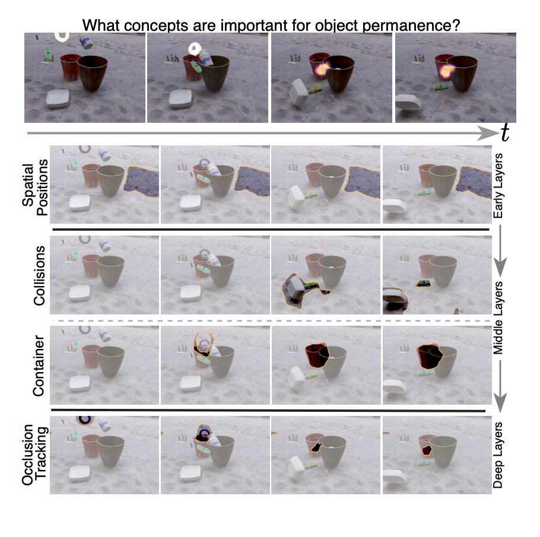

# Understanding Video Transformers via Universal Concept Discovery
Official PyTorch Implementation of our CVPR 2024 (Highlight) Paper! This repository enables the discovery and ranking 
of concepts in video transformers.

[Matthew Kowal](https://mkowal2.github.io/),
[Achal Dave](https://www.achaldave.com/),
[Rares Ambrus](https://www.tri.global/about-us/dr-rares-ambrus),
[Adrien Gaidon](https://adriengaidon.com/),
[Konstantinos G. Derpanis](https://csprofkgd.github.io/),
[Pavel Tokmakov](https://pvtokmakov.github.io/home/)

York University, Samsung AI Centre Toronto, Toyota Research Institute, Vector Institute


[Paper](https://arxiv.org/abs/2401.10831), [project page](https://yorkucvil.github.io/VTCD/)



# 1) Create Conda Environment
```
conda create -n VTCD python=3.10.12
conda activate VTCD
cd models/hide_seek/tcow/TimeSformer ; pip install -e .
cd ../../../../segment-anything; pip install -e .
pip install 'git+https://github.com/facebookresearch/fvcore'
pip install -r requirements.txt
conda install pytorch==1.12.1 torchvision==0.13.1 torchaudio==0.12.1 cudatoolkit=11.3 -c pytorch
```

# 2) Data Preparation
## Kubric Data Preparation
- Download from [this link](https://tri-ml-public.s3.amazonaws.com/datasets/tcow/val_3600_3799.zip) and extract the Kubric dataset. 
- Set args.kubric_path in run_vcd.py args to the path of the Kubric dataset.

## SSV2 Data Preparation
- Download SSV2 dataset from https://developer.qualcomm.com/software/ai-datasets/something-something and follow the instructions to extract the dataset.
- Set args.ssv2_path in run_vcd.py args to the path of the SSV2 dataset.

## DAVIS16 Data Preparation
- Download and extract the DAVIS16 dataset from https://davischallenge.org/davis2016/code.html
- Set args.davis16_path in run_vcd.py args to the path of the DAVIS16 dataset.

# 3) Runing VTCD to discover and rank the importance of concepts

## 3.1) Download pretained models
Download the pre-trained video understanding models from the 
[following link](https://drive.google.com/drive/folders/1SGfDjA35BhxsJ8k-HwElzWn2YVSCoIot?usp=sharing) and extract 
the folder into the root directory of the project. If you are using Segment Anything, download the pre-trained models from
these links and place them in the same checkpoint directory as above: 
[ViT_b](https://dl.fbaipublicfiles.com/segment_anything/sam_vit_b_01ec64.pth) and [ViT_h](https://dl.fbaipublicfiles.com/segment_anything/sam_vit_h_4b8939.pth).


## 3.2) Run VTCD for concept discovery
Running VTCD uses the script [run_vcd.py](run_vcd.py). For an example of a running VTCD with VideoMAE finetuned on SSV2 for the target class 'Rolling something on a flat surface', while saving the concepts, and then evaluate the importance of the concepts using CRIS, use the following commands:
```
python run_vcd.py --exp_name VideoMAE_FT_SSv2_Rolling --target_class 'Rolling something on a flat surface' --attn_head 0 1 2 3 4 5 6 7 8 9 10 11  --max_num_videos 29 --model vidmae_ssv2_ft --dataset ssv2 --cluster_layer 0 1 2 3 4 5 6 7 8 9 10 11  --slic_compactness 0.1 --force_reload_videos
python CRIS.py --exp_name VideoMAE_FT_SSv2_Rolling --num_masks 4000 --heads_removed_each_step 100 --masking_ratio 0.5
```

To run VTCD on the [TCOW](https://tcow.cs.columbia.edu/) model pre-trained on Kubric dataset, 
use [TCOW_Kubric.sh](exps%2FTCOW_Kubric.sh), as:
```
sh exps/TCOW_Kubric.sh
```

# 4) Finding Rosetta concepts between the four models
Rosetta concepts are concepts that are (i) important in all models and (ii) have a high degree of overlap (IoU) across 
the models. The script [Find_Rosetta_Concepts_SSv2_Rolling.sh](exps%2FFind_Rosetta_Concepts_SSv2_Rolling.sh) runs VTCD and CRIS for
all four models on the SSv2 class 'Rolling something on a flat surface'. Then it uses 
[find_rosetta_concepts.py](find_rosetta_concepts.py) to find the rosetta concepts between the four models: [TCOW](https://tcow.cs.columbia.edu/), 
[VideoMAE (FT), VideoMAE (Pretrained)](https://github.com/MCG-NJU/VideoMAE), and 
[InternVideo](https://github.com/OpenGVLab/InternVideo). To run the script, use the following command:
```
sh exps/Find_Rosetta_Concepts_SSv2_Rolling.sh
```

# 5) Applications with VTCD
We also provide two applications of VTCD in the repository, model pruning and zero-shot semi-supervised DAVIS16 VOS task.
## 5.1) Model pruning with VTCD
Given that VTCD can rank the importance of concepts or heads, we can use this information to prune the model. We target
the SSv2 classes that identify types of 'spills', and use CRIS to rank the model heads in terms of their importance for
these classes. We then prune the model by removing the least important heads and evaluate the performance of the pruned 
model. To pruning the VideoMAE finetuned model, use the following command (where 60 136 137 138 159 63 are the target
class indexes for the 'spill' classes):
```
python evaluation/prune_heads_full_dataset.py --target_class_idxs 60 136 137 138 159 63 --num_masks 25 --num_workers 8 --batch_size 2
```

## 5.2) Using VTCD for zero-shot semi-supervised DAVIS16 VOS task
We use VTCD to discover the object tracking concepts in the model and then use these concepts to perform zero-shot 
semi-supervised VOS on the DAVIS16 dataset. We first run VTCD on the full video groundtruth to discover these 
concepts on the DAVIS16 training set, and then use these concepts to perform zero-shot semi-supervised VOS on the 
DAVIS16 validation set. To run the zero-shot semi-supervised VOS task for all four models, use the following command:
```
sh exps/D16_VOS_VTCD.sh
```


# Adding a new model to VTCD
Follow the steps below to add a new model to the VTCD framework:
1) Load the model and checkpoint into the function load_model in utilities/utils.py, then add model name to args.model in run_vcd.py
2) Implement forward pass of model in the get_layer_activations function in vcd.py (this needs to return a features variable (e.g., Keys, Queries, Values) with shape # features.shape = num_layers X channels X num_heads X time X height X width)
3) If you want to use CRIS for importance rankings, you will need to provide the forward pass and metric (e.g., loss, accuracy) in head_concept_attribution_fidelity.py at lines 208,270, and 515
4) To add a new dataset, you need to add two arguments (args.path_to_dataset and args.dataset) in run_vcd.py and then add a new function in vcd.py, load_DATASET_videos, that loads the videos (b x c x t x h x w) and returns them in the same format as in the current datasets (e.g., look at the load_ssv2_videos function for an example). 

# BibTeX
If you find this repository useful, please consider giving a star :star: and citation :t-rex:
```
@inproceedings{kowal2024understanding,
  title={Understanding Video Transformers via Universal Concept Discovery},
  author={Kowal, Matthew and Dave, Achal and Ambrus, Rares and Gaidon, Adrien and Derpanis, Konstantinos G and Tokmakov, Pavel},
  booktitle={Conference on Computer Vision and Pattern Recognition},
  year={2024}
}
```

# Acknowledgements
- Code structure modified from the [ACE](https://github.com/amiratag/ACE) repository.
- Model implementations and checkpoints from [TCOW](https://tcow.cs.columbia.edu/), 
[VideoMAE](https://github.com/MCG-NJU/VideoMAE), and [InternVideo](https://github.com/OpenGVLab/InternVideo).
